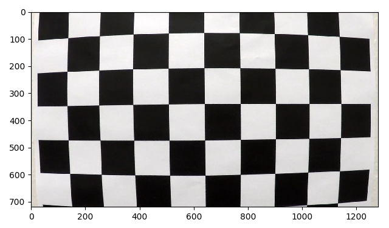
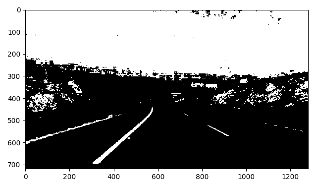
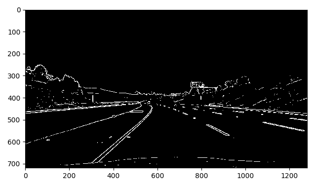

# Advanced Lane Finding Project

[//]: # (Image References)

[distorted_calib]: ./examples/distorted_calib.png "Distorted calibration image"
[corrected_calib]: ./examples/corrected_calib.png "Distortion corrected calibration image"
[distorted_calib_2]: ./examples/distorted_calib_2.png "Distorted calibration image"
[corrected_calib_2]: ./examples/corrected_calib_2.png "Distortion corrected calibration image"
[distorted_vid_frame]: ./examples/distorted_vid_frame.png "Distorted video frame"
[corrected_vid_frame]: ./examples/corrected_vid_frame.png "Corrected video frame"
[straight_orig_perspective]: ./examples/straight_orig_perspective.png "Straight lines"
[straight_overhead_perspective]: ./examples/straight_overhead_perspective.png "Straight lines overhead perspective"
[gradx_thresh]: ./examples/gradx_thresh.png "x-direction gradient thresholding"
[saturation_thresh]: ./examples/saturation_thresh.png "Image saturation thresholding"
[hue_thresh]: ./examples/hue_thresh.png "Image hue thresholding"
[hue_and_saturation]: ./examples/hue_and_saturation.png "Hue & saturation thresholding"
[magnitude_thresh]: ./examples/grad_magnitude_thresh.png "Image gradient magnitude thresholding"
[direction_thresh]: ./examples/grad_direction_thresh.png "Image gradient direction thresholding"
[magnitude_and_direction]: ./examples/magnitude_and_direction.png "Magnitude & direction thresholding"
[red_thresh]: ./examples/red_thresh.png "Red channel thresholding"
[combined_thresh]: ./examples/combined_thresh.png "Combined thresholding"
[masked_combined]: ./examples/masked_combined.png "Masked"
[overhead_masked]: ./examples/overhead_masked.png "Overhead masked"
[window_search]: ./examples/window_search.png "Window search"
[margin_search]: ./examples/margin_search.png "Margin search"
[original_draw_lane]: ./examples/original_draw_lane.png "Original draw lane"
[overhead_draw_lane]: ./examples/overhead_draw_lane.png "Overhead draw lane"
[result]: ./examples/result.png "Pipeline result"

## Goals
* Compute the camera calibration matrix and distortion coefficients given a set of chessboard images.
* Apply a distortion correction to raw images.
* Use color transforms, gradients, etc., to create a thresholded binary image.
* Apply a perspective transform to rectify binary image ("birds-eye view").
* Detect lane pixels and fit to find the lane boundary.
* Determine the curvature of the lane and vehicle position with respect to center.
* Warp the detected lane boundaries back onto the original image.
* Output visual display of the lane boundaries and numerical estimation of lane curvature and vehicle position.

## Files
* find_lanes.py - Python module containing code to detect and draw lanes on a video or image. 
* project_video.mp4 - The video output produced by find_lanes.py

## Camera Calibration

I start by preparing "object points", which will be the (x, y, z) coordinates of the chessboard corners in the world. Here I am assuming the chessboard is fixed on the (x, y) plane at z=0. The object points are the known coordinates for the corners of a 9x6 chessboard and are the same for each calibration image.

For each calibration image, I convert the image to grayscale and use the `cv2.findChessboardCorners()` function to detect the "image points" which are the (x, y) position of each of the corners in the image plane. I  used the output object points and image points to compute the distortion coefficients and transform matrix using the `cv2.calibrateCamera()` function.  I applied this distortion correction to two of the calibration images using the `cv2.undistort()` function and obtained this result: 

| Distorted                                                 | Corrected                                                 |
|-----------------------------------------------------------|-----------------------------------------------------------|
|    |    |
|  |  |

## Pipeline 

### Input

### Distortion Correction

The first step of the pipeline corrects for camera distortion. This is performed using using either computed or previously saved camera distortion coefficients and the transform matrix using the `cv2.undistort()` function.

| Distorted                                                   | Corrected                                                   |
|-------------------------------------------------------------|-------------------------------------------------------------|
|  |  |

### Gradient and Color Channel Thresholding

At this stage, the pipeline computes a binary thresholded image that contains the lane lines. The color channels, gradients and threshold ranges were determined experimentally to capture as much information about the lane lines as possible while filtering out everything else.

| Gradient-X (3x3, 30 - 180)                           |
|------------------------------------------------------|
|  |

| Hue (16-30)                                        | Saturation (90-255)                                       |
|----------------------------------------------------|-----------------------------------------------------------|
|  |  |

| Hue & Saturation                                           |
|------------------------------------------------------------|
|  |

| Gradient Magnitude (3x3, 60-255)                              | Gradient Direction (3x3, 0.9-1.3)              |
|---------------------------------------------------------------|------------------------------------------------|
|  |  |

| Magnitude & Direction                                           |
|-----------------------------------------------------------------|
|  |

| Red Color Channel (220-255)                                        |
|------------------------------------------------------|
|    |

| Green Color Channel (200-255)                                        |
|--------------------------------------------------------|
|    |

| Combined Thresholds (gradx \| (hue & saturation) \| red \| green \| (magnitude & direction)) |
|----------------------------------------------------------------------------------------------|
|                                       |

### Perspective Transform

The pipeline then performs a perspective transform to give an overhead view. The source and destination points for this transform can be seen below.

| Source        | Destination   | 
|:--------------|:--------------| 
| 684, 448      | 320, 0        | 
| 188, 720      | 320, 720      |
| 1126, 720     | 960, 720      |
| 595, 448      | 960, 0        |

The source points were chosen by examining the line pixel positions on an image of the car driving down a straight road. That image and the perspective transorm can be seen below.

| Straight Lines (Original Perspective)                      | Straight Lines (Overhead Perspective)                     |
|------------------------------------------------------------|-----------------------------------------------------------|
|  |  |

The pipeline masks the binary image from the pervious section and performs an overhead perspective transform:

| Mask Region |
|-------------|
| 650, 400    |
| 1200, 720   |
| 100, 720    |
| 650, 400    |

| Masked                                                  | Overhead                                                |
|---------------------------------------------------------|---------------------------------------------------------|
|  |  |

### Lane Line Search

If both lane lines were not previously detected, the overhead binary image is searched using sliding windows. The position of the bottom windows (one for each lane) is determined by computing the maximum of a histogram of activated pixels in the x-direction over the lower half of the image. I limit the range of this search to 220-420 for the left line and 860-1060 for the right line.

Once the base of each line is found. The position of the next window for each line is determined by computing the mean position of the activated pixels found within the previous window. This process repeats until all windows have been placed and the pixels contained within them are returned. The pipline then uses the `numpy.polyfit()` function to fit a second order polynomial to the detected lane pixels. An example can be seen below.

| Window Search                                         |
|-------------------------------------------------------|
|  |

If both lane lines were previously detected, the pixels belonging to each lane are found by searching within a margin around the previous fit. An example can be seen below.

| Margin Search                                         |
|-------------------------------------------------------|
|  |

At this point, a sanity check is performed to verify that these polynomials represent lane lines that could be found on the road. First, it checks that the x-position of the top of the left line is not greater than the x-position of the top of the right line. Second, it checks that the distance between the two lines at the top and bottom of the image does not vary by more than 200 pixels.

If the sanity check succeeds, the x-positions are stored for each fitted line and an average fit over the past five frames is computed to smooth the output lane position. If the check fails or no pixels were detetected, the last good line fit is used for up to five frames. After five missed frames, the line is reset and a sliding window search will be used.

### Draw Lane

The pipeline draws the lane in the overhead perspective and then transforms it back to the original perspective.

|  Overhead                                                  |  Original                |
|------------------------------------------------------------|--------------------------|
|  |  |

### Output

The lane is combined with the original image corrected for camera distortion. The line curvature and car offset from the center of the lane are computed using the fitted lines and added to the image:

## Video

Here's a [link to my video result](./project_video.mp4)

## Discussion

Getting the pipeline to work against the project video was quite easy. However, when I ran this pipeline againts either challenge video, I found that the threshold values that I picked did not do a good job of detecting lane lines with those road surfaces and lighting conditions. I also found that the pipeline detected shadows and patched road surfaces as lane lines. It would require some experimentation with those videos to see if I could get my pipeline to generalize well.
