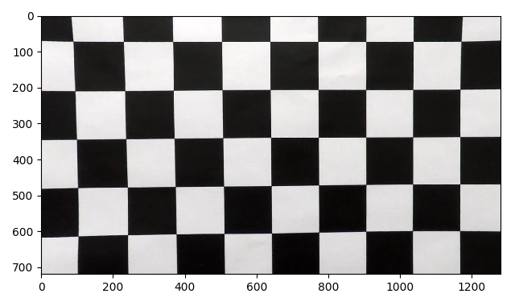
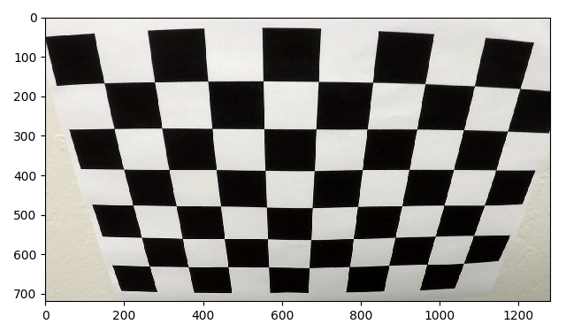
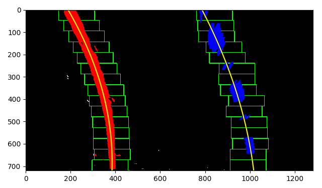
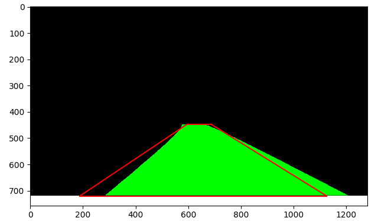

# Advanced Lane Finding Project

[//]: # (Image References)

[distorted_calib]: ./examples/distorted_calib.png "Distorted calibration image"
[corrected_calib]: ./examples/corrected_calib.png "Distortion corrected calibration image"
[distorted_calib_2]: ./examples/distorted_calib_2.png "Distorted calibration image"
[corrected_calib_2]: ./examples/corrected_calib_2.png "Distortion corrected calibration image"
[distorted_vid_frame]: ./examples/distorted_vid_frame.png "Distorted video frame"
[corrected_vid_frame]: ./examples/corrected_vid_frame.png "Corrected video frame"
[straight_orig_perspective]: ./examples/straight_orig_perspective.png "Straight lines"
[straight_overhead_perspective]: ./examples/straight_overhead_perspective.png "Straight lines overhead perspective"
[gradx_thresh]: ./examples/gradx_thresh.png "x-direction gradient thresholding"
[saturation_thresh]: ./examples/saturation_thresh.png "Image saturation thresholding"
[hue_thresh]: ./examples/hue_thresh.png "Image hue thresholding"
[hue_and_saturation]: ./examples/hue_and_saturation.png "Hue & saturation thresholding"
[magnitude_thresh]: ./examples/grad_magnitude_thresh.png "Image gradient magnitude thresholding"
[direction_thresh]: ./examples/grad_direction_thresh.png "Image gradient direction thresholding"
[magnitude_and_direction]: ./examples/magnitude_and_direction.png "Magnitude & direction thresholding"
[red_thresh]: ./examples/red_thresh.png "Red channel thresholding"
[combined_thresh]: ./examples/combined_thresh.png "Combined thresholding"
[masked_combined]: ./examples/masked_combined.png "Masked"
[overhead_masked]: ./examples/overhead_masked.png "Overhead masked"
[window_search]: ./examples/window_search.png "Window search"
[margin_search]: ./examples/margin_search.png "Margin search"
[original_draw_lane]: ./examples/original_draw_lane.png "Original draw lane"
[overhead_draw_lane]: ./examples/overhead_draw_lane.png "Overhead draw lane"
[result]: ./examples/result.png "Pipeline result"

## Goals
* Compute the camera calibration matrix and distortion coefficients given a set of chessboard images.
* Apply a distortion correction to raw images.
* Use color transforms, gradients, etc., to create a thresholded binary image.
* Apply a perspective transform to rectify binary image ("birds-eye view").
* Detect lane pixels and fit to find the lane boundary.
* Determine the curvature of the lane and vehicle position with respect to center.
* Warp the detected lane boundaries back onto the original image.
* Output visual display of the lane boundaries and numerical estimation of lane curvature and vehicle position.

## Camera Calibration
The code for this step is contained in the first code cell of the IPython notebook located in "./examples/example.ipynb" (or in lines # through # of the file called `some_file.py`).  

I start by preparing "object points", which will be the (x, y, z) coordinates of the chessboard corners in the world. Here I am assuming the chessboard is fixed on the (x, y) plane at z=0, such that the object points are the same for each calibration image.  Thus, `objp` is just a replicated array of coordinates, and `objpoints` will be appended with a copy of it every time I successfully detect all chessboard corners in a test image.  `imgpoints` will be appended with the (x, y) pixel position of each of the corners in the image plane with each successful chessboard detection.  

I then used the output `objpoints` and `imgpoints` to compute the camera calibration and distortion coefficients using the `cv2.calibrateCamera()` function.  I applied this distortion correction to the test image using the `cv2.undistort()` function and obtained this result: 

| Distorted                                                 | Corrected                                                 |
|-----------------------------------------------------------|-----------------------------------------------------------|
|    |    |
|  |  |


## Pipeline 

### Distortion Correction

| Distorted                                                   | Corrected                                                   |
|-------------------------------------------------------------|-------------------------------------------------------------|
|  |  |

### Gradient and Color Channel Thresholding

| Sobel X (3x3, 30 - 180)                              |
|------------------------------------------------------|
|  |

| Hue (16-30)                                        | Saturation (90-255)                                       |
|----------------------------------------------------|-----------------------------------------------------------|
|  |  |

| Hue & Saturation                                           |
|------------------------------------------------------------|
|  |

| Magnitude (3x3, 60-255)                                       | Direction (3x3, 0.9-1.3)                       |
|---------------------------------------------------------------|------------------------------------------------|
|  |  |

| Magnitude & Direction                                           |
|-----------------------------------------------------------------|
|  |

| Red (220-255)                                        |
|------------------------------------------------------|
|    |

| Green (200-255)                                        |
|--------------------------------------------------------|
|    |

| Combined Thresholds (gradx \| (hue & sat) \| r \| g \| (magnitude & direction)) |
|-----------------------------------------------------------------------------|
|                      |

### Perspective Transform

| Source        | Destination   | 
|:--------------|:--------------| 
| 684, 448      | 320, 0        | 
| 188, 720      | 320, 720      |
| 1126, 720     | 960, 720      |
| 595, 448      | 960, 0        |

| Straight Lines (Original Perspective)                      | Straight Lines (Overhead Perspective)                     |
|------------------------------------------------------------|-----------------------------------------------------------|
|  |  |

| Masked                                                  | Overhead                                                |
|---------------------------------------------------------|---------------------------------------------------------|
|  |  |

### Lane Line Search

| Window Search                                         |
|-------------------------------------------------------|
|  |

| Margin Search                                         |
|-------------------------------------------------------|
|  |

### Draw Lane

| Draw Lane (Overhead Perspective)                           |
|------------------------------------------------------------|
|  |

| Draw Lane (Original Perspective)                           |
|------------------------------------------------------------|
|  |

| Result                                         |
|------------------------------------------------|
|  |

#### 1. Provide an example of a distortion-corrected image.

To demonstrate this step, I will describe how I apply the distortion correction to one of the test images like this one:

#### 2. Describe how (and identify where in your code) you used color transforms, gradients or other methods to create a thresholded binary image.  Provide an example of a binary image result.

I used a combination of color and gradient thresholds to generate a binary image (thresholding steps at lines # through # in `another_file.py`).  Here's an example of my output for this step.  (note: this is not actually from one of the test images)

#### 3. Describe how (and identify where in your code) you performed a perspective transform and provide an example of a transformed image.

The code for my perspective transform includes a function called `warper()`, which appears in lines 1 through 8 in the file `example.py` (output_images/examples/example.py) (or, for example, in the 3rd code cell of the IPython notebook).  The `warper()` function takes as inputs an image (`img`), as well as source (`src`) and destination (`dst`) points.  I chose the hardcode the source and destination points in the following manner:

```python
src = np.float32(
    [[(img_size[0] / 2) - 55, img_size[1] / 2 + 100],
    [((img_size[0] / 6) - 10), img_size[1]],
    [(img_size[0] * 5 / 6) + 60, img_size[1]],
    [(img_size[0] / 2 + 55), img_size[1] / 2 + 100]])
dst = np.float32(
    [[(img_size[0] / 4), 0],
    [(img_size[0] / 4), img_size[1]],
    [(img_size[0] * 3 / 4), img_size[1]],
    [(img_size[0] * 3 / 4), 0]])
```

This resulted in the following source and destination points:

| Source        | Destination   | 
|:-------------:|:-------------:| 
| 585, 460      | 320, 0        | 
| 203, 720      | 320, 720      |
| 1127, 720     | 960, 720      |
| 695, 460      | 960, 0        |

I verified that my perspective transform was working as expected by drawing the `src` and `dst` points onto a test image and its warped counterpart to verify that the lines appear parallel in the warped image.


#### 4. Describe how (and identify where in your code) you identified lane-line pixels and fit their positions with a polynomial?

Then I did some other stuff and fit my lane lines with a 2nd order polynomial kinda like this:


#### 5. Describe how (and identify where in your code) you calculated the radius of curvature of the lane and the position of the vehicle with respect to center.

I did this in lines # through # in my code in `my_other_file.py`

#### 6. Provide an example image of your result plotted back down onto the road such that the lane area is identified clearly.

I implemented this step in lines # through # in my code in `yet_another_file.py` in the function `map_lane()`.  Here is an example of my result on a test image:


### Pipeline (video)

#### 1. Provide a link to your final video output.  Your pipeline should perform reasonably well on the entire project video (wobbly lines are ok but no catastrophic failures that would cause the car to drive off the road!).

Here's a [link to my video result](./project_video.mp4)

---

### Discussion

#### 1. Briefly discuss any problems / issues you faced in your implementation of this project.  Where will your pipeline likely fail?  What could you do to make it more robust?

Here I'll talk about the approach I took, what techniques I used, what worked and why, where the pipeline might fail and how I might improve it if I were going to pursue this project further.  
